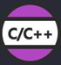
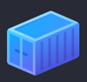
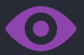
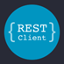
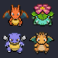

<h1 align="center">MIS EXTENSIONES INSTALADAS EN VISUAL STUDIO CODE</h1>

| Logo                                    | Nombre y Versión                | Publicador             |
| :---:                                   |     :---:                       |   :---:                |
|           | Angular Language Service        | Angular                |
|    | Better Comments                 | Aaron Bond             |
|                   | C/C++                           | Microsoft              |
|                 | C/C++ Compile Run               | danielpinto8zz6        |
|          | CodeSnap                        | adpyke                 |
|                 | Codex – OpenAI’s coding agent   | Open AI                |
|                 | Container Tools                 | Microsoft              |
|                 | Contenedores de desarrollo      | Microsoft              |
|          | Cyberpunk                       | Max                    |
|                 | Debugger for Java               | Microsoft              |
|            | Dracula Theme Official          | Dracula Theme          |
|                 | Draw.io Integration             | Henning Dieterichs     |
|                 | Draw.io Preview                 | purocean               |
|             | ESLint                          | Microsoft              |
|                | Extension Pack for Java         | Microsoft              |
|       | Fluent Icons                    | Miguel Solorio         |
|           | GitLens — Git supercharged      | GitKraken              |
|                | Gradle for Java                 | Microsoft              |
|            | Image preview        	        | Kiss Tamás             | 
|              | JavaScript (ES6) code snippets  | charalampos karypidis  |
|            | Jupyter                         | Microsoft              |
|            | Jupyter Cell Tags               | Microsoft              | 
|            | Jupyter Keymap                  | Microsoft              |
|   | Jupyter Notebook Renderers      | Microsoft              |
|            | Jupyter Slide Show              | Microsoft              |
|                |                                 |                        |
|                |                                 |                        |
|        | Live Server                     | Ritwick Dey            |
|           | Markdown Preview Enhanced       | Yiyi Wang              |
|                | Material Icon Theme             | Philipp Kief           |
|                |                                 |                        |
|            | Monokai Pro      	            | monokai                |
|           | Night Owl    	                | sarah.drasner          | 
|                |                                 |                        |              
|           | Prettier - Code formatter       | Prettier               |                        
|           | Prettify JSON    	            | Mohsen Azimi           |                        
|                |                                 |                        | 
|             | Pylance         	            | Microsoft              |                        
|             | Python                          | Microsoft              |
|             | Python Debugger         	    | Microsoft              |
| 	          | Python Environments      	    | Microsoft              |
|                |                                 |                        |
|          | SonarQube for IDE        	    | SonarSource            |                        
|            | Spanish Language Pack for Visual Studio Code | Microsoft |
|            | Symbols                         | Miguel Solorio         |
|                 |                                 |                        |
|                 |                                 |                        |
|           | Vibrancy Continued              | illixion               |                        
|       | vscode-icons                    | VSCode Icons Team      |
|                | vscode-pokemon                  | jakobhoeg              |
|                | W3C Validation                  | Umoxfo                 |
|                | W3C Web Validator               | Celian Riboulet        | 